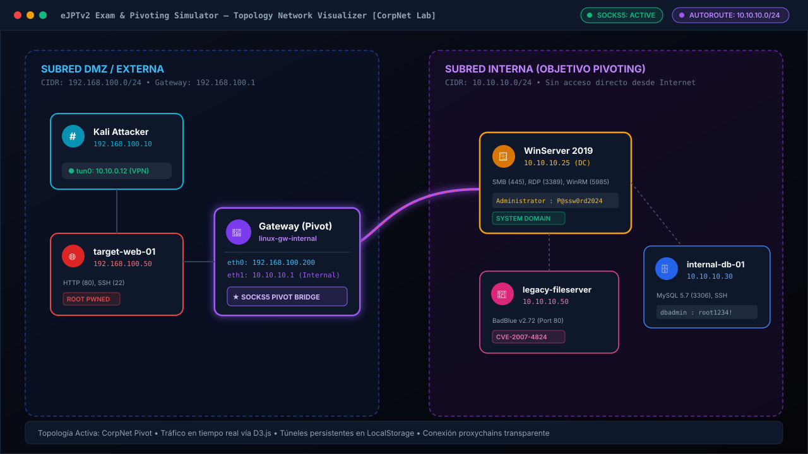
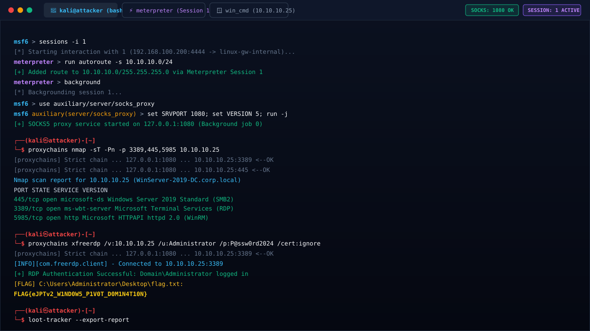
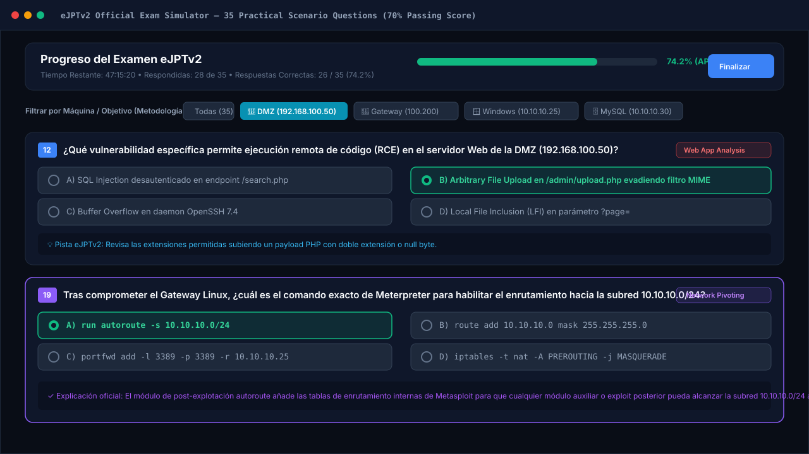
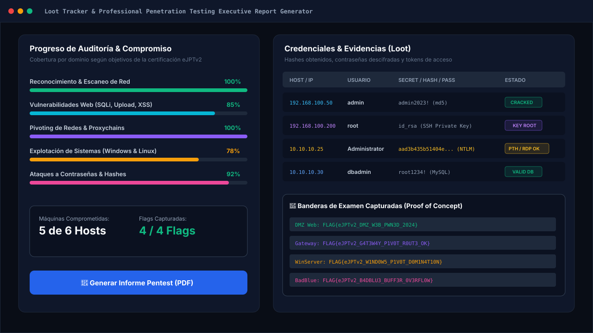

<p align="center">
  
</p>

<h1 align="center">eJPTv2 Exam & Pivoting Simulator</h1>

<p align="center">
  <strong>Simulador interactivo y entorno de entrenamiento práctico para la certificación eJPTv2 (eLearnSecurity Junior Penetration Tester v2 / INE Security)</strong>
</p>

<p align="center">
  <a href="#-demostración-visual"></a>
  <a href="#-pivoting-y-t%C3%BAneles-socks5"></a>
  <a href="#-cuestionario-oficial-35-preguntas"></a>
  <a href="#-licencia"></a>
</p>

---

## 📌 Tabla de Contenidos

- [🎯 Descripción General](#-descripción-general)
- [🖼️ Demostración Visual](#-demostración-visual)
- [✨ Características Principales](#-características-principales)
- [🏗️ Arquitectura y Topología de Red](#️-arquitectura-y-topología-de-red)
- [🚀 Metodología eJPTv2 (Inspirada en Juan Rivas - r1vs3c)](#-metodología-ejptv2-inspirada-en-juan-rivas---r1vs3c)
- [💻 Guía Rápida de Comandos y Pivoting](#-guía-rápida-de-comandos-y-pivoting)
- [📦 Instalación y Despliegue](#-instalación-y-despliegue)
- [🛠️ Stack Tecnológico](#️-stack-tecnológico)
- [📄 Generación de Informes Pentest (PDF)](#-generación-de-informes-pentest-pdf)
- [🤝 Contribuciones](#-contribuciones)
- [⚖️ Licencia y Disclaimer](#️-licencia-y-disclaimer)

---

## 🎯 Descripción General

**eJPTv2 Exam & Pivoting Simulator** es una plataforma web completa desarrollada en React, TypeScript y Tailwind CSS que recrea con máxima fidelidad la experiencia del examen oficial **eJPTv2**.

Permite a estudiantes, investigadores y pentesters practicar sin necesidad de levantar máquinas virtuales pesadas ni consumir créditos en la nube:

1. **Topologías de red realistas de múltiples subredes** (DMZ externa 192.168.100.0/24 y subred interna protegida 10.10.10.0/24).
2. **Terminal interactiva de Kali Linux** con emulación de `nmap`, `msfconsole`, `meterpreter`, `proxychains`, `crackmapexec`, `xfreerdp`, `evil-winrm`, `john`, `hashcat`, `hydra`, `wpscan` y utilidades de ataque a contraseñas.
3. **Pivoting auténtico**: enrutamiento de subredes internas mediante `autoroute`, servidor `socks_proxy` en puerto 1080 y persistencia del estado en `localStorage`.
4. **Cuestionario dinámico de 35 preguntas oficiales** con puntuación de corte del 70% (25/35), filtrado por host según metodología de auditoría real y explicaciones pedagógicas.
5. **Loot Tracker & Generador de Reporte PDF**: seguimiento de credenciales, flags capturadas y exportación de informe ejecutivo descargable.

---

## 🖼️ Demostración Visual

### 1. Mapa de Red Interactivo con Pivoting y Flujo de Tráfico
Visualizador de topología en tiempo real con D3.js. Muestra hosts DMZ, puente Gateway Dual-Homed (`192.168.100.200` / `10.10.10.1`) y la red corporativa interna inaccesible desde el exterior.



---

### 2. Terminal Kali Linux, Meterpreter y Pivoting SOCKS5
Emulador de terminal completo con soporte de pestañas para **Kali Bash**, **Meterpreter Session** y **Windows Shell (Evil-WinRM / CMD)**, con historial navegable mediante flechas `↑`/`↓` y túneles proxychains.



---

### 3. Cuestionario Oficial de Certificación (Metodología por Host)
Examen de 35 preguntas categorizadas según los dominios de la certificación eJPTv2. Incluye el selector inteligente para resolver preguntas agrupadas por máquina objetivo.



---

### 4. Loot Tracker y Generador de Informe Pentest (PDF)
Control de banderas de examen, contraseñas descifradas, hashes NTLM/MD5 y exportación con un clic a un PDF ejecutivo listo para entregar.



---

## ✨ Características Principales

| Módulo | Descripción |
| :--- | :--- |
| **🌐 Laboratorios Multi-Entorno** | Selección entre entornos: **CorpNet Pivoting** (DMZ + Windows Server 2019 + MySQL) y **Fintech Banking Net** (Servicios bancarios + AD). |
| **⚡ Motor de Comandos Realista** | Soporte de argumentos auténticos para decenas de herramientas: `nmap -sV -sC`, `dirb`, `gobuster`, `wpscan`, `hydra`, `john`, `cupp`, `zip2john`, `ssh2john`, `xfreerdp`, `psexec.py`. |
| **🔀 Pivoting Completo** | Flujo completo de pivoting: compromiso del gateway dual-homed &rarr; `run autoroute -s 10.10.10.0/24` &rarr; `socks_proxy` &rarr; `proxychains <herramienta>`. |
| **💾 Persistencia en LocalStorage** | Guarda automáticamente túneles activos, rutas, banderas capturadas, notas y respuestas al recargar o cerrar el navegador. |
| **📋 Cuestionario Oficial eJPTv2** | 35 preguntas prácticas con retroalimentación inmediata, pistas y porcentaje de aprobación calculado en vivo. |
| **🔊 Notificaciones & Audio Feedback** | Sistema de alertas sonoras sutiles (Web Audio API) y notificaciones Toast al descubrir servicios, capturar flags o establecer túneles. |
| **📄 Exportación a PDF** | Reporte ejecutivo profesional en PDF generado en cliente mediante `jspdf`. |

---

## 🏗️ Arquitectura y Topología de Red

```text
               +-------------------------------------------------------+
               |                   KALI ATTACKER                       |
               |       IP: 192.168.100.10  |  VPN tun0: 10.10.0.12     |
               +---------------------------+---------------------------+
                                           |
                                [ SUBRED DMZ ] (192.168.100.0/24)
                                           |
                    +----------------------+----------------------+
                    |                                             |
     +--------------+--------------+               +--------------+--------------+
     |      target-web-01          |               |     linux-gw-internal       |
     |      192.168.100.50         |               |     [ DUAL-HOMED GATEWAY ]  |
     |  HTTP: 80 | SSH: 22         |               |  eth0: 192.168.100.200      |
     |  Vulnerabilidad: LFI/Upload |               |  eth1: 10.10.10.1           |
     +-----------------------------+               +--------------+--------------+
                                                                  |
                                              [ AUTOROUTE & SOCKS5 PIVOT ]
                                                                  |
                                            [ SUBRED INTERNA ] (10.10.10.0/24)
                                                                  |
          +-------------------------------+-----------------------+-------+
          |                               |                               |
+---------+----------+          +---------+----------+          +---------+----------+
|  WinServer 2019 DC |          |   internal-db-01   |          |  legacy-fileserver |
|  10.10.10.25       |          |   10.10.10.30      |          |  10.10.10.50       |
|  SMB: 445          |          |   MySQL: 3306      |          |  BadBlue v2.72     |
|  RDP: 3389         |          |   SSH: 22          |          |  Port: 80          |
|  WinRM: 5985       |          |   Creds: dbadmin   |          |  CVE-2007-4824     |
+--------------------+          +--------------------+          +--------------------+
```

---

## 🚀 Metodología eJPTv2 (Inspirada en Juan Rivas - r1vs3c)

Siguiendo las mejores prácticas compartidas por Juan Rivas en su [artículo sobre la eJPTv2](https://r1vs3c.github.io/posts/review-ejpt/):

1. **Lectura Estratégica Previa**:
   - Lee todas las preguntas del cuestionario al inicio de la prueba para saber exactamente qué servicios, puertos y banderas debes buscar en cada máquina.
2. **Escaneo Global Inicial**:
   - Ejecuta un barrido de toda la subred accesible para identificar todos los objetivos antes de enfocarte en uno solo:
     ```bash
     nmap -sV -sC -p- 192.168.100.0/24 -oN dmz_scan.txt
     ```
3. **Resuelve Máquina por Máquina (Agrupación por Host)**:
   - Utiliza el filtro **"Por Host / Objetivo"** en la pestaña de cuestionario para contestar las preguntas asociadas a una máquina inmediatamente después de explotarla.
4. **Pivoting Ordenado**:
   - Tras conseguir sesión Meterpreter en el Gateway, agrega la ruta y activa el proxy antes de intentar cualquier conexión hacia la subred 10.10.10.0/24.
5. **Ataques a Contraseñas**:
   - Revisa siempre credenciales por defecto, aprovecha diccionarios como `rockyou.txt` o genera diccionarios contextuales con `cewl` o `cupp`.

---

## 💻 Guía Rápida de Comandos y Pivoting

### 1. Reconocimiento de la DMZ
```bash
# Descubrimiento de hosts vivos
arp-scan -I eth0 --localnet

# Escaneo detallado de la subred DMZ
nmap -sV -sC -Pn 192.168.100.0/24

# Fuzzing web en target-web-01
dirb http://192.168.100.50 /usr/share/wordlists/dirb/common.txt
gobuster dir -u http://192.168.100.50 -w /usr/share/wordlists/dirb/common.txt
wpscan --url http://192.168.100.50/blog -U sysadmin -P /usr/share/wordlists/rockyou.txt
```

### 2. Compromiso del Gateway y Metasploit
```bash
# Iniciar Metasploit
msfconsole

# Interactuar con la sesión establecida
sessions -i 1

# Enrutar la subred interna
meterpreter > run autoroute -s 10.10.10.0/24
meterpreter > run autoroute -p
meterpreter > background

# Iniciar servidor proxy SOCKS5
msf6 > use auxiliary/server/socks_proxy
msf6 auxiliary(server/socks_proxy) > set SRVPORT 1080
msf6 auxiliary(server/socks_proxy) > set VERSION 5
msf6 auxiliary(server/socks_proxy) > run -j
```

### 3. Escaneo y Explotación Interna con Proxychains
```bash
# Escaneo de puertos TCP a través del túnel
proxychains nmap -sT -Pn -p 445,3389,5985,3306 10.10.10.25

# Conexión RDP a Windows Server 2019
proxychains xfreerdp /v:10.10.10.25 /u:Administrator /p:P@ssw0rd2024 /cert:ignore

# Administración remota Windows (WinRM)
evil-winrm -i 10.10.10.25 -u Administrator -p P@ssw0rd2024

# Pass-The-Hash con Impacket
proxychains psexec.py -hashes :aad3b435b51404eeaad3b435b51404ee:e19ccf75ee54e06b06a5907af13cef42 Administrator@10.10.10.25
```

### 4. Cracking de Contraseñas
```bash
# Ataques de fuerza bruta con Hydra
hydra -l dbadmin -P /usr/share/wordlists/rockyou.txt 10.10.10.30 mysql

# Extracción y descifrado de hashes
zip2john backup.zip > backup.hash
john --wordlist=/usr/share/wordlists/rockyou.txt backup.hash
hashcat -m 1000 ntlm_hashes.txt /usr/share/wordlists/rockyou.txt
```

---

## 📦 Instalación y Despliegue

### Requisitos Previos
- **Node.js** >= 18.x
- **npm**, **pnpm** o **bun**

### Pasos de Instalación

```bash
# 1. Clonar el repositorio
git clone https://github.com/TU_USUARIO/ejptv2-exam-pivoting-simulator.git
cd ejptv2-exam-pivoting-simulator

# 2. Instalar dependencias
npm install

# 3. Iniciar servidor de desarrollo
npm run dev

# 4. Compilar para producción
npm run build

# 5. Previsualizar la compilación de producción
npm run preview
```

La aplicación estará disponible inmediatamente en `http://localhost:3000`.

---

## 🛠️ Stack Tecnológico

- **Frontend**: [React 19](https://react.dev/), [TypeScript](https://www.typescriptlang.org/)
- **Build Tool**: [Vite 6 / 8](https://vite.dev/)
- **Estilos**: [Tailwind CSS v4](https://tailwindcss.com/)
- **Visualización de Red**: [D3.js v7](https://d3js.org/)
- **Iconografía**: [Lucide React](https://lucide.dev/)
- **Métricas y Gráficos**: [Recharts](https://recharts.org/) & Motion
- **Generación de Reportes**: [jsPDF](https://github.com/parallax/jsPDF)
- **Audio Sintetizado**: HTML5 Web Audio API

---

## 📄 Generación de Informes Pentest (PDF)

El simulador cuenta con un motor nativo en cliente para emitir el **Informe Oficial de Penetration Testing**, estructurado según los estándares profesionales:

- Portada ejecutiva con fecha, auditor y objetivo evaluado.
- Resumen ejecutivo con matriz de criticidad de hallazgos.
- Descripción técnica de vulnerabilidades encontradas (CVEs, vectores de ataque y evidencias).
- Registro de banderas y pruebas de concepto (PoC).
- Recomendaciones de mitigación prioritarias.

---

## 🤝 Contribuciones

¡Las contribuciones son bienvenidas! Si deseas agregar nuevos escenarios de pivoting, preguntas adicionales para el examen o compatibilidad con más herramientas:

1. Haz un Fork del proyecto (`gh repo fork`)
2. Crea una rama para tu feature (`git checkout -b feature/nuevo-modulo-pivoting`)
3. Haz commit de tus cambios (`git commit -m 'feat: añadir módulo de túnel chisel y dnscat2'`)
4. Haz push a la rama (`git push origin feature/nuevo-modulo-pivoting`)
5. Abre un Pull Request describiendo tus mejoras

---

## ⚖️ Licencia y Disclaimer

Este proyecto está bajo la Licencia **MIT**. Consulta el archivo `LICENSE` para más detalles.

> **Aviso de Responsabilidad**: Esta herramienta tiene fines exclusivamente educativos y de preparación académica para certificaciones de seguridad ofensiva (eJPTv2 / INE Security). Todas las máquinas, redes y direcciones IP simuladas son ficticias y no interactúan con redes reales externas.
